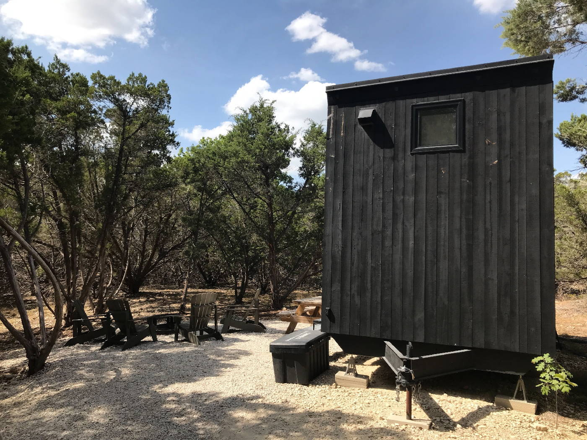
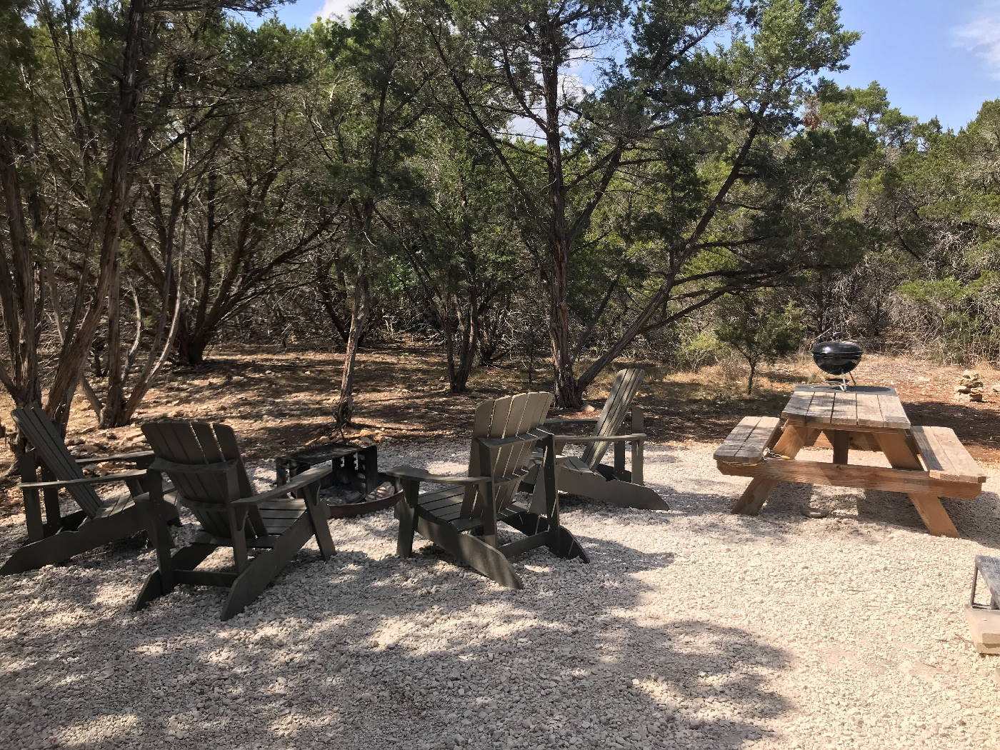
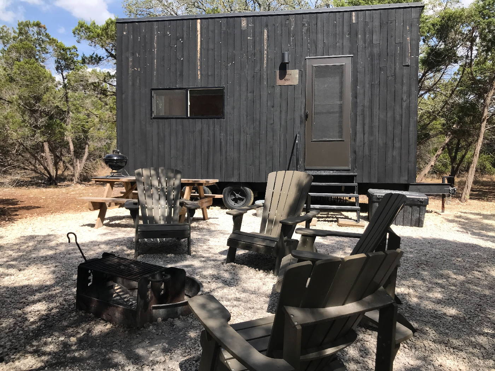
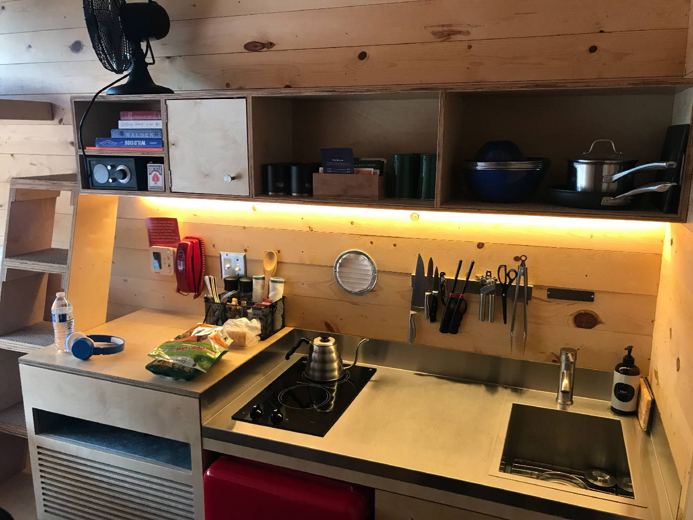
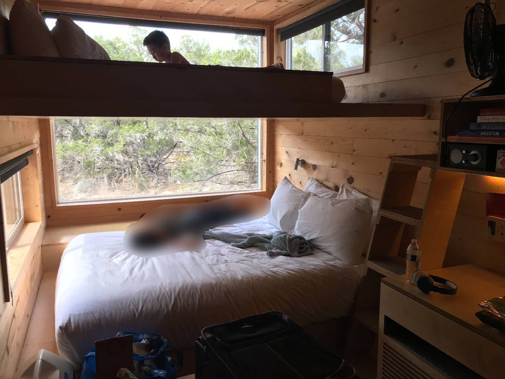
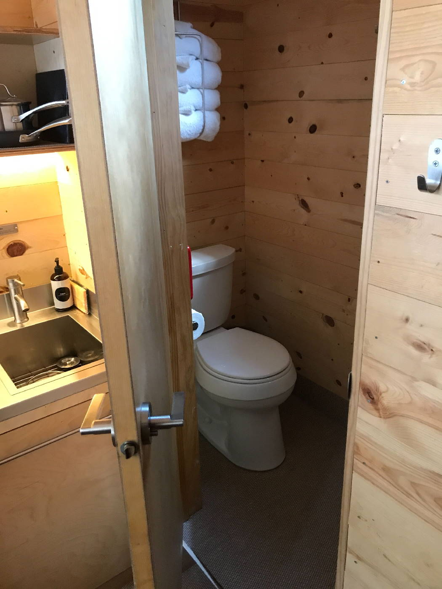
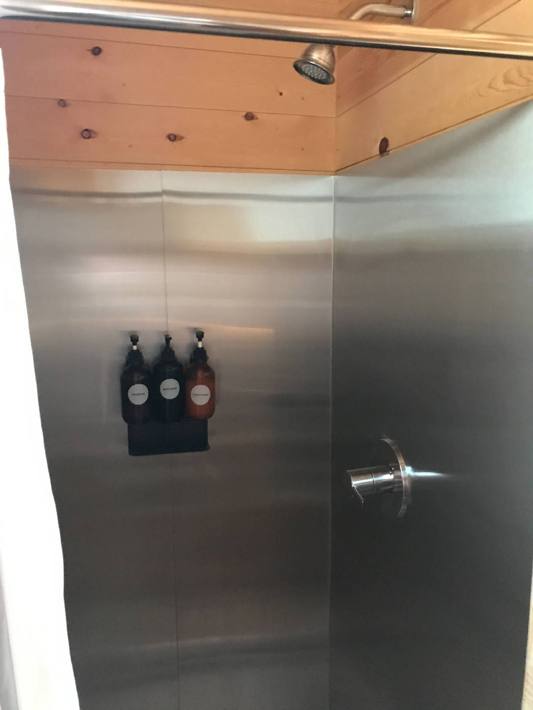

We had our first glamping trip as a family last weekend, via [getaway.house](https://getaway.house).

It was perhaps a bad time for us to go. None of us like the extreme heat of Texas during the summer, yet we still enjoyed it. We couldn't use the fire pit due to the burn-ban, but they instead provided a grill (you can see it in photos below) along with a bag of charcoal.

We didn't have to meet anyone to let us in. They give you a code to unlock the door. There's also several other campsites in the area. We could see a couple others through the trees, but it still feels very private.

It was also nice to be able to see more stars late at night, since the campsite is further from any big cities. I would definitely do it again, but probably in the Winter here in Texas.

Some photos of the the campsite and cabin:

They have quite a few things, so you don't have to worry about bringing them yourself. The cabin also has an AC unit (to the left of the red fridge.)

My son on his iPad🤣 The wife is camera-shy. But I love the big window.

The toilet and shower work very well.

