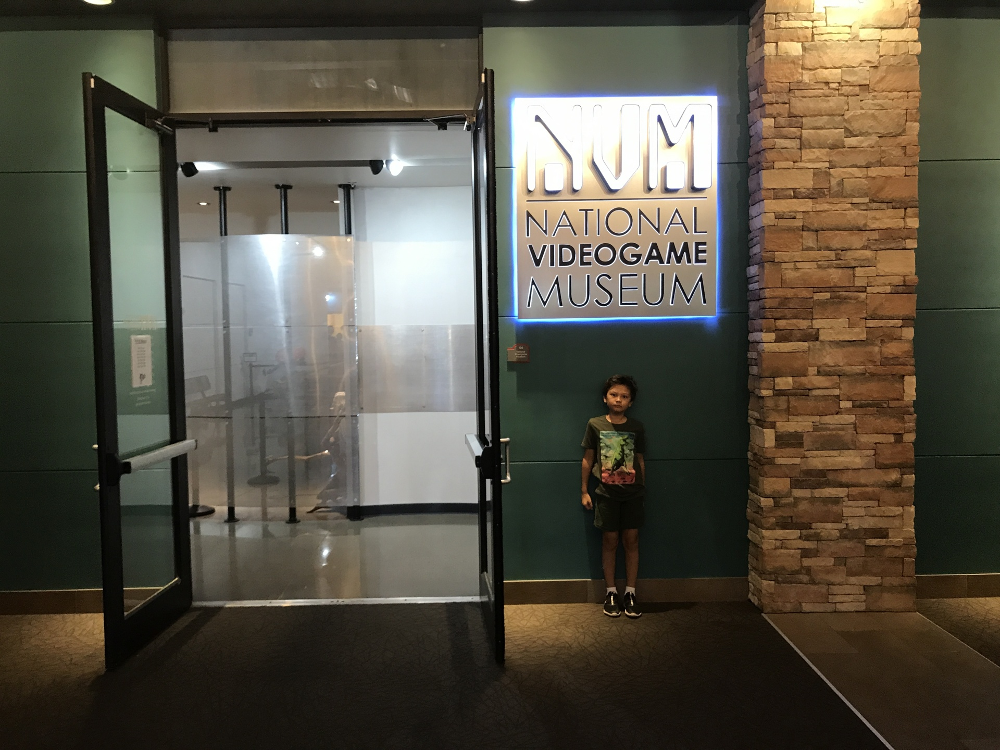

import EmbedVideo from '../../../../components/EmbedVideo.astro'
import nvm_typing_dead_02_mp4 from './nvm-typing-dead-02.mp4'
import nvm_arcade_06_mp4 from './nvm-arcade-06.mp4'

This past weekend, we drove to Dallas for vacation and one of the places we went was the [National VideoGame Museum](http://nvmusa.org/) in Frisco. I wanted to go in blindly and knew nothing about it before going. I was pleasently surprised by how much they have there, and by the majority of hands-on computers and consoles they have, that are in good working condition. Not to mention there's a nice-sized room at the end, filled with 80's (and some early-90's) arcade games, all of which were in great working order and require tokens, complete with 80's music playing. It was well worth the trip, in my opinion.

If you also would rather not be spoiled by all the following pics, then just stop here, close this browser tab, and go visit the museum. There's many other things to do in the Dallas area to make it more worth the trip.

Here's the entrance. You buy tickets for admission inside, along with tokens for the arcade.

My son looks angry, but he was actually very happy and just joking around. Too much work to ask him to smile. 😄

The first thing you see after your admitted. A nice timeline of video-game consoles. See.. he can smile.

To the left was the really old stuff that was before my time.

Everyone has heard of Pong though.

Neat to see many boxes for older consoles, such as the Magnavox Odyssey.

Some nostalgic T-shirts

Various controllers. Out of the older ones in the top left, I only recognize `ColecoVision` (very top-left) and `Intellivision II` (3rd from top-left).

My son playing `The Typing of the Dead` for `Dreamcast`.

Video of him playing it
<EmbedVideo mp4={nvm_typing_dead_02_mp4} width="300" />

Going back to the consoles timeline near the museum entrance. My first console (technically my parent's) was the `Intellivision`. Further in the museum, they had an Intellivision hooked up to a TV and you could play two player `BurgerTime` on a couch, one of my favorite games for the system (and my mom's favorite game.)

I was kinda surprised not to see a `Famicom` , nor `PC Engine`, nor `Super Famicom` here, but you can see they have the western versions (`NES`,  `TurboGrafx 16`, `SNES`). Later on, they do have the keyboard addon for the Famicom on display, and the museum does have other Japanese stuff as you'll see in later pictures, but it was definitely more western-baised.

`Super Nintendo` is still one of my favorite consoles. I love the 16-bit era in general.

The original `PlayStation` is another favorite of mine.

Some of my friends had a `Commodore 64`, but our family had an `Apple IIc` instead.

They had several other computers. I just didn't get photos of them. Including an Apple II with playable [Karateka](https://en.wikipedia.org/wiki/Karateka_(video_game)), which my son played a bit. I played it first in middle school typing class. 😄

They had a bargin bin of Intellivision games, but I already own some of these. `Astrosmash` was my first console game. Still like the `Dragonfire` cover art.

I never knew they attempted to make a computer attachment for the Intellivision. It's stuff like this that makes the trip to the museum especially interesting.

Here's that keyboard for the Famicom I metioned earlier.

Dragon's Lair stuff. They also had a playable (I think?) arcade unit to the right of this. I remember being amazed at the animation quality of the game, but I was never any good at it.

My son played around in Mario Paint for awhile, which is kinda funny, cause I kept telling him he can just do that at home (still got it). To the right of this (not pictured) was a playable Doom level of the museum itself. Impressive for how much detail it has.

They had some collections of badges and pins.

Someone at the museum likes Donkey Kong Country. It's an amazing series, but I was kinda surprised to see it as one of their main sections.

`Earthbound`, AKA `Mother 2` - One of my all-time favorite games. ❤️
Also had `ROB` with `Gyromite`.

Finally, here's the arcade. Sorry, some of these pictures didn't come out very well.

I loved `Carnival` back when my parents would take me to `Chuck E Cheese` in the early '80s. Was surprised to find an actual working unit here.

Video of my son playing Blue Shark
<EmbedVideo mp4={nvm_arcade_06_mp4} width="300" />

My son and I got to play one of my all-time favorite arcade games, `Gauntlet`, together. This really made my day.

The museum still has more things I didn't take pictures of. We had a blast though. Even my wife, who isn't into video games, enjoyed it a lot.