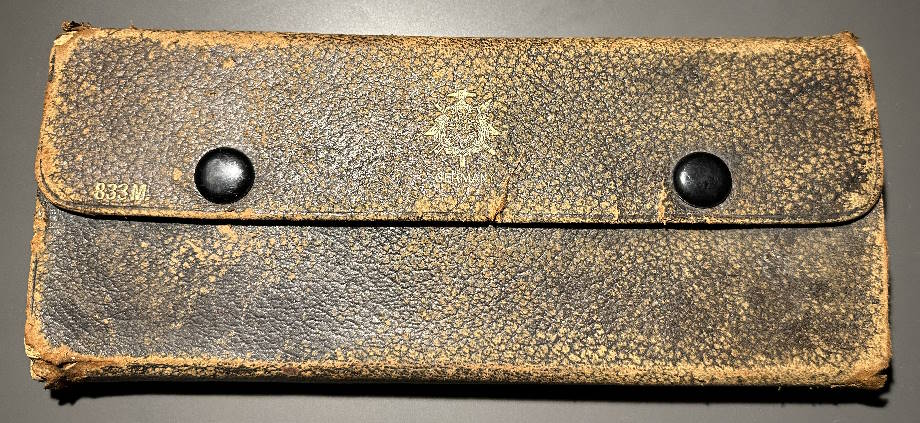
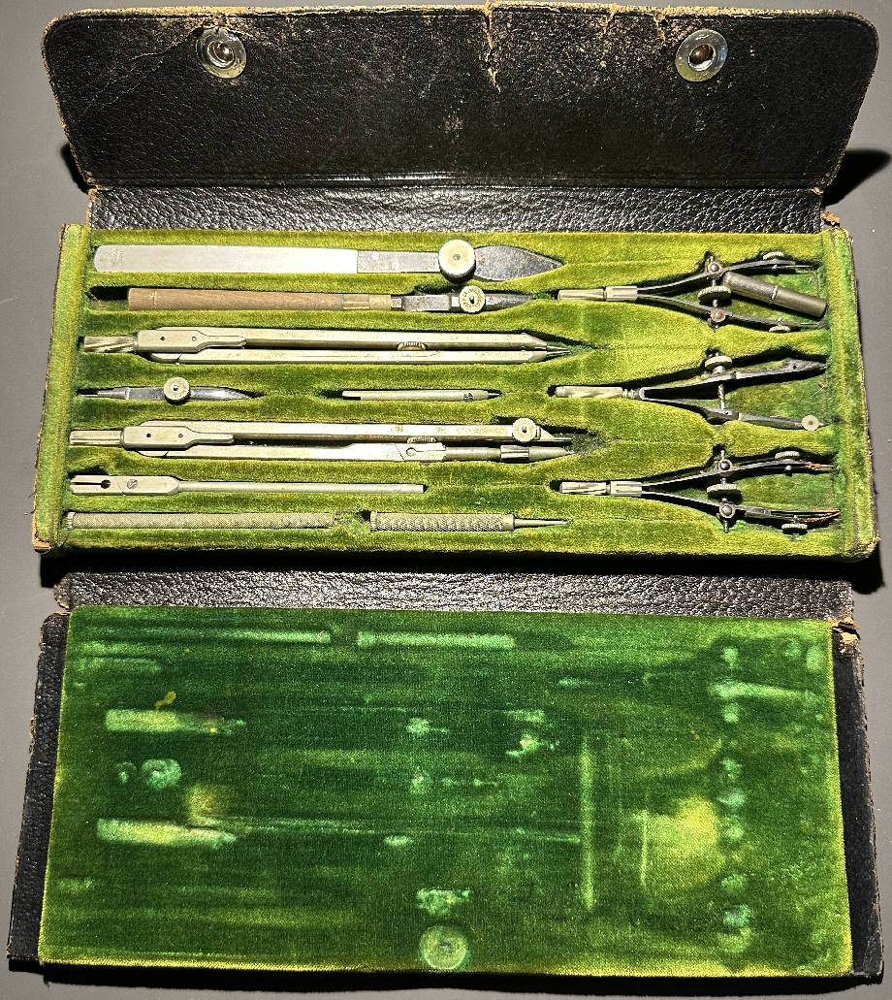
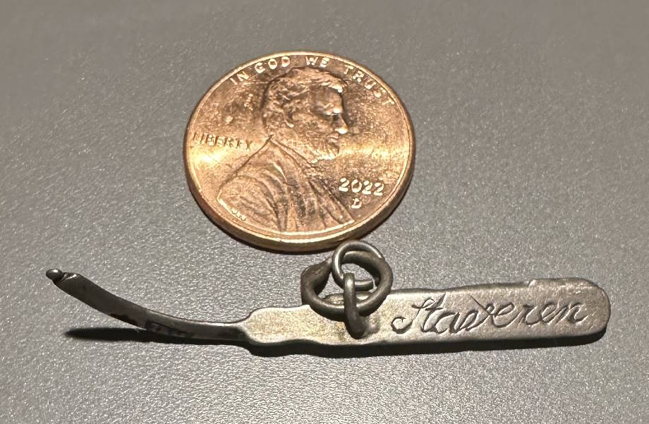
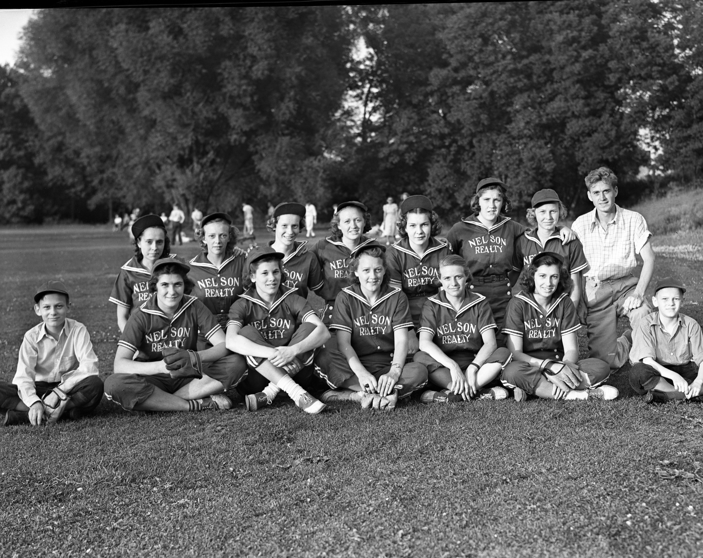
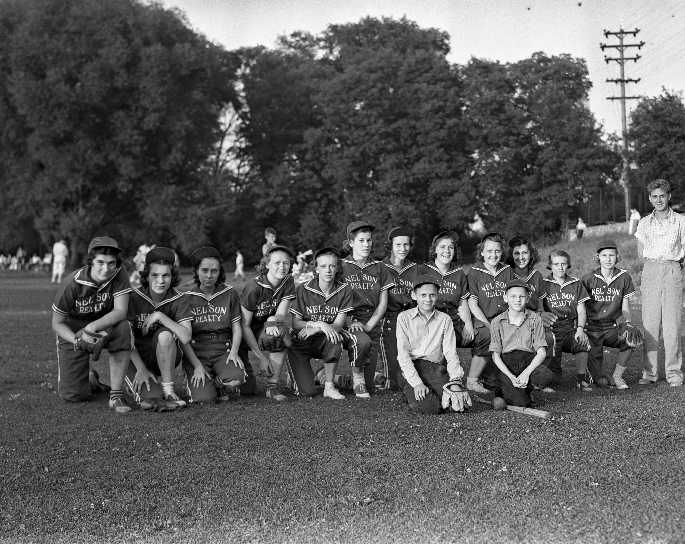
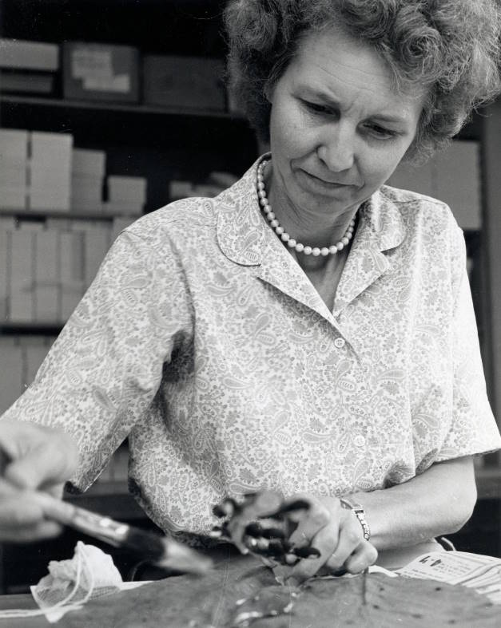
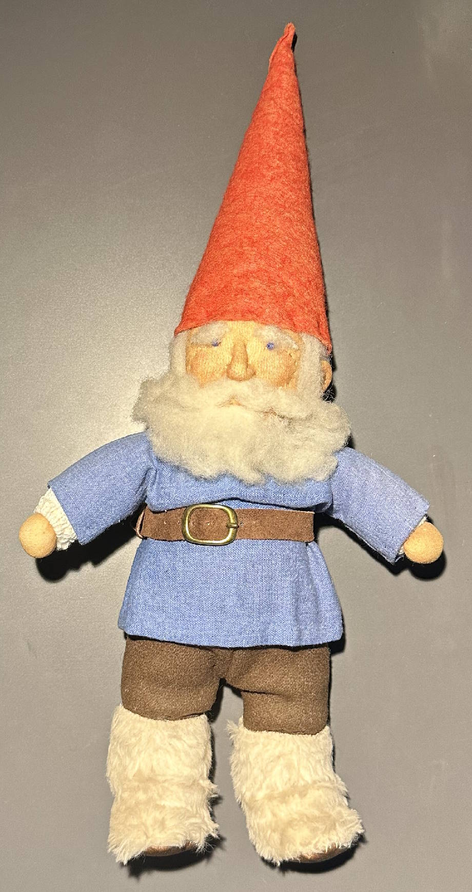

(*This is an interview of my grandmother on my mom's side, Florence Hoseney, that I did about her life on April 18, 2001 for my Sociology 302 class at Northern Michigan University. My son recently got a tri-fold assignment in his gifted-students class that involves five generations of family and immigrating to the United States. I started talking to him about my grandmother and the interview, so I thought typing up the interview in the form of a blog post here is a good way to help explain things to my son, but also preserve the printout and share with others, and gives me a chance to learn more and modernize it by adding some images and links. Things that weren't easy to get access to even back when I first did the interview! I'll have some of these "footnotes" of mine scattered throughout the interview where I have something to add. They will be in parentheses and italics like this. -Gordon*)

---

Florence May Van Akkeren was born October 25th, 1917 in Dunkirk, New York, to Jacob & Helena Albertsma Van Akkeren. Jacob's mother was a Tichelaar. The Tichelaar were the founders of the second oldest business in the Netherlands, which is a [ceramic tile factory in Makkum](https://www.google.com/maps/place/Royal+Tichelaar+Makkum/@53.0608545,5.3798347,12.92z/data=!4m6!3m5!1s0x47c8c28bcdd8cfe5:0x93255ff70d1359c5!8m2!3d53.0544128!4d5.4110217!16s%2Fg%2F1tdkfx37?entry=ttu) still in business today. They have a [website](https://www.tichelaar.com/) now with an [online shop](https://www.tichelaar.com/shop) where you can order some hand-painted ceramics. (*They almost certainly didn't have this website back when I initially did this interview because the web was still so new and businesses were just starting to create websites.*) Florence's grandmother, Rinske Pieters Flietstra, had nine living children, but still never got used to the matters of childbirth. Florence's grandparents probably emigrated from the Netherlands to America because some of their sons were sailors and thought there was much more opportunity for advancement. Each of the nine children, three sons and six daughters, had his/her own special chore in Holland. Max, the oldest son, was an engineer at International Business Machine (IBM.) Florence's mother was Helena Margareta Albertsma. Piet was a draftsman at IBM. Claude was the youngest of the family, who never decided what he wanted to do with his life. He wanted to be an aviator, learned to fly, but ruined his eyesight when a piece of steel injured his eye. Augusta was one of the cleaners of the family. One of her chores was to wash the alley between her house and the neighbor's. The other girls had chores, but Florence didn't remember who did the dusting, scrubbing, laundry, etc. Florence's parents were pressured to move to America by the sailors in the family, but there were also already cousins in Dunkirk that were doing well. When in Dunkirk, living near a big lake, Lake Erie, was a reminder of Holland.

Florence is the youngest of three children, born seven years after her brother John. Her father was an old man to her, since she was the youngest child. Her mother wasn't happy about expecting another child, so she was like a "living doll" to her sister. Her sister Jenny was born 15 months before John. Lots of her ancestor's descendants live today in Holland, Michigan and Grand Rapids, Michigan.

> "My earliest memory of living on the farm is walking in the greenhouse followed by a pet duck, not getting out of the way of the horses, being in the hay mound in the barn and being smothered by my grandmother's big hugs."

She comes from a social class of royalty, since her great-great-grandmother was a countess. When asking her if the fact that she came from royalty would affect he life, she said while laughing, "I'm better than everyone else." She still has a wonderful sense of humor in her old age.

Florence came to Ann Arbor, Michigan, at the age of three, after her father got fed up with the up and down economy in New York. Dunkirk's main industry was manufacturing locomotives. The town was prosperous, but when the factory shut down, the townspeople struggled. This caused her father to search for a new job. He saw an advertisement for a gardener at the University of Michigan. He had beautiful handwriting, which was probably the reason why his letter resulted in his employment at U of M's Botanical Garden. The family took a boat from Buffalo, New York, to Detroit, and then took the streetcar to Ann Arbor. They lived in a building above the gardens until they built their own house nearby. This sparked an interest for her in house building. Later, when she was about nine or ten years old, she helped build her mother's sister's house in Ann Arbor. After studying for two years as an Architect in college, she realized she wasn't getting what she wanted out of the courses, so she dropped out.

One of Florence's architectual drafting sets

She lived on Harpst Street, and it was the 2nd house in a new neighborhood, so it was a very wide-open area at the time. There were only about 35,000 people in Ann Arbor then, compared to about 160,000 people now. (*at the time of this writing*) Since she lived in such a new neighborhood, she had to go far to play with other children, and she didn't have many friends throughout her schooling other than family itself. She said it was hard for country kids to have friends, because of all the chores that kept them busy. She started school at the age of seven, at Stone School Elementary. She enjoyed taking piano lessons around the age of nine or ten. She had a job pulling weeds, making a 25 cents and hour.

In junior high, she had lots of opportunities to enjoy various interests. There was a big gymnasium and playing field. She was captain of the field hockey team, who at one time beat the U of M freshmen team. During the winter, she went skating nearly every night, either at the U of M ice rink or at a large pond near her house, which would freeze over. Her grades suffered, but she loved to skate and watch the hockey players at night. She won medals at city skate meets, both third and second places. When she won first place, she was very disappointed when all she got was a blue ribbon.

> "When there were city skate meets, I won medals for third and second place. When I won first place for speed, they gave out blue ribbons. That was so disappointing, because you can't wear a blue ribbon on a chain!"

A skate-shaped metal prize Florence won at a ice skating meet. (Penny for size reference.)

She would also ride wildly on a very fast iceboat in a nearby pond that would freeze over, so she had no fear as a child. One day while skating, she met a friend named Lila, whose mother had died, and so she was a mother to Lila.

She decided to go to University High School instead of Ann Arbor High (now known as Pioneer High), because University High School had better equipment than Ann Arbor High. She didn't date anyone during school, but she did go to prom with someone.

Florence apparently also played softball. These were taken in 1938. She is next to the coach in both pictures.

After she dropped out of college, she visited her relatives in New York State, but her sister told her to come back, since her mother started a knit shop. As she was helping out at the knit shop, a shy, attractive man walked by to have lunch at a nearby eatery. She doesn't remember how they met, but they became friends, and he flattered her by taking her to the "J. Hop," which was the social event of the year. But just as things got going, the bombing of Pearl Harbor changed everything. The man was in the ROTC, so he was enlisted as an officer. She had then heard on the radio about a job delivering army trucks out of Detroit to the east. Her mom wasn't receiving enough yarn, so she went to Detroit and was hired on the spot. She was sent out with six or seven other drivers to drive the trucks to New Jersey and ride a train back overnight, then go back to the office, grab another truck, and so on. It took three days for a single trip. The trucks could only go 33 mph, because gas was rationed and the roads were in bad shape. There were also no heaters in the trucks and she had to work throughout the winter.

On one of the trips driving trucks, her and her partner had just finished gassing up their vehicles when a rather "over-bearing fellow" drove up to fill his own vehicle. He motioned for them to get out of his way. Florence thought, "That's the kind of guy a person like me needs." In the course of pursuing other aims, we frequently stumble across something we have long sought: The person of our dreams appears on the social horizon (Sloan, 1996: 77). For Florence, this was one of those moments. She didn't see him again until they were on the train. His name was Lawrence Hoseney, and was born in North Dakota in 1910. He won all her money playing poker with them. Her next trip required a boat trip to Buffalo to pick up some special trucks. He arranged for the only stateroom left to be shared by him and her! He was recently divorced and they married shortly after. They had six kids within seven years. She was widowed at 44, when a drunk driver hit her husband. This caused big changes in her life. She took on the role of both mother and father. She never remarried thereafter.

After her husband's death, she fell back on family and she got a job working as a Herbarium Botanist with her sister Jenny. Her job was to categorize plants for study. Part of her job was looking for mushrooms, which sparked a big interest in mushroom hunting. Mushroom hunting was something she would really come to love, especially after retirement. She discovered two new species of mushrooms: Psathyrella and Boletus. This was a huge accomplishment for her.

(*As of 2023, her name is now also all over the web if you search for these mushroom species or if you want to know how to [dry mushrooms using silica gel](https://www.google.com/search?q=The+silica+gel+method+for+drying+mushrooms). I was able to find with a little searching, her original write-up about it in the Michigan Botanist which is archived on a separate site - [The silica Gel Method For Drying Mushrooms - by Florence Hoseney](https://babel.hathitrust.org/cgi/pt?id=mdp.39015029420703&seq=227&q1=Hoseney)*)

Florence at the University Herbarium

After retirement at age 62, she would mushroom hunt every chance she could. She joined the Michigan Mushroom Hunter's club, which was a very sociable point in her life. Her involvement in the community had grown, which was a huge change for her, socially. This seemed to change her self-perception. She had no responsibilities to worry about, so it was a great time of enjoyment. Some face retirement as a dreaded event and then find life without employment distasteful and stressful (Furr, 1997: 158). However, Florence was able to replace work with the enjoyable activities that she now has much more time to enjoy.

Many important people existed throughout her life. Her mother taught her how to knit and sew different types of handwork. She didn't see her aunts and uncles who lived in New York State, but family was important to her. In high school, she looked up to her art teacher. All through school she took art classes. She did many different arts and crafts, not just drawing. A professor of Mycology, Professor Alexander Smith, was impressed by her ability to collect things, and so he made her his assistant. He was a big influence on her. Maggie Rogers is the editor of the magazine Mushroom. They have exchanged letters and talk on the phone. Both had an influence for Florence to continue mushroom hunting. Most of the important people in her life contributed to her arts, crafts, and hobbies that kept her interest, and kept her going throughout her life stages. She still does many different arts and crafts today.

There are various theories that apply to adult development. Such theories attempt to explain the social and behavioral aspects of individual adults in society. Some of these theories are disengagement theory, activity theory, role theory, and psychosocial theory.

Disengagement theory explains how aging affects the relationship between the individuals and society. It suggests that the elderly disengage or withdraw from society withdraws from them. It says that as people age, they have less ability and fewer interests in maintaining social connections and performing roles (Furr, 1997: 155). Age is an ascribed characteristic according to which we are assigned a transitional status. We are constantly getting older, thus our chronological age and the consequent statuses change. At each stage in the transition, we must be socialized to age appropriate behavior (Perry, 1997: 212). Because of Florence's health, she is limited in the activities that she would usually perform. It took her a while to get over Whooping Cough, but she lost about 25lbs and a lot of muscular atrophy. Then, two years later, or just two and one half years ago, she had a stroke, which gave her a short-term memory loss. The doctor told her she shouldn't drive after she had the stroke. Also, a great deal of her adult life, she's suffered from migraine headaches, where she would lose her peripheral visual temporarily. She would have to lie down from a half-hour to a few hours until they went away. Early in the onset of dealing with her migraines, she sought help of a professional, a neurological specialist. He helped her deal with her headaches by taking medication and later on controlling them via diet. She still gets headaches today. She also doesn't get out of the house much, since she tires so easily, so she can't mushroom-hunt anymore.

Activity theory suggests that successful adaptation to aging occurs by staying active. Maintaining middle-age roles and replacing lost roles are the keys to high life satisfaction during old age (Furr, 1997: 155). Florence keeps herself busy in the house. She still does many arts and crafts that she did throughout her life, including quilting, sewing, knitting, painting, rug hooking, making dolls and making hats, which is a good exercise for her hands and arms.

This is just one of many many things that Florence made. A gnome.

(*My wife recently surprised me by serving me a Danish pastry, and when I bit into it, I instantly noticed it was stuffed with [marzipan](https://en.wikipedia.org/wiki/Marzipan), which immediately reminded me of my grandmother, Florence. Marzipan was something she liked to make from time to time, and she would make them in shapes and colors of little fruits. Another "craft" she was great at.*)

Ageism promotes the idea that older workers are not as productive as younger ones, an idea that originally led to the institutionalization of retirement at the age of 65. In reality, although the elderly experience a decline in perception and reaction speed, they perform as well as, if not better than younger works (Perry, 1997: 214). However, today Florence has many ideas for creating various arts and crafts. But she doesn't have the materials or the energy to create them.

Role theory suggests that the elderly have to adjust to conditions that are markedly different than other stages of life. Individuals experience a traumatic relinquishing of roles, and must accept the social relationships of roles stereotypically or negatively associated with being old (Furr, 1997: 155). Florence never "active old", but has rather been forced into it by her disabilities in old age. She doesn't like the way she looks now and thinks she's not as attractive, and so she doesn't want to go out in public as much. Like most minorities, the elderly are stereotyped as senile, unproductive, poor, lonely, living in nursing homes and institutions, being set in their ways and unable to change, and feeling miserable (Perry, 1997: 213). Florence is far from this stereotypical definition of the elderly. She lives with her daughter Laura in a quiet apartment, is in rather good health for her age, and is still very positive with a sense of humor.

Psychosocial theory suggests that as people reach the end of their lives, they often look back and review their decisions, relationships, and life's work. Most older people enjoy telling stories about the past (Furr, 1997: 157). Florence feels some despair when looking back to her earlier years, and noticing that she didn't have many friends. This was a touchy subject for her during the interview. But after her retirement, she met many friends that shared the same interests, especially in the Michigan Mushroom Hunter's Club. She has always been a pleasant person and has tried to treat people the way she would want to be treated. This has helped attract friends throughout her life. Also, she feels much integrity toward her life. She generally enjoys talking about herself and her past, and finds many of the events that took place during her life very fascinating. When people perceive their lives as meaningful and are content with themselves and their life's work, they feel that their time was well spent and that they can die without any regrets (Furr, 1997: 159).

An important task in old age is coming to terms with one's impending death and the deaths of significant others (Furr, 1997: 159). In terms of death, Florence has pretty much accepted her current disabilities. She also doesn't have a spouse to leave behind, which can be better psychologically. Married elderly are probably more anxious about death for fear of leaving their spouse behind and concerns about the spouse's well-being. Participation in religion is a buffer against death anxiety because it provides both a social support network and a comforting ideology (Furr, 1997: 159). In terms of religion, she's a non-believer. "I don't need any threats of hell to keep me on the straight and narrow." She was very independent throughout her life. This independence can be seen through the hard work throughout her life, the chores she did as a child, taking over a man's job during the war, and continuing to raise six children after she was widowed. Her family has always been very important to her. She feels sorry for people who get adopted and can't fall back on heritage. She's also always felt equal in terms of gender. "There are so many opportunities, that if you apply yourself, you can do just about anything."

---

<b>Works Cited</b>

Furr, LeRoy Allen. <u>Exploring Human Behavior and the Social Environment</u>. 
&nbsp;&nbsp;&nbsp;&nbsp;&nbsp;&nbsp;&nbsp;&nbsp;Needham Heights, MA: Allyn &amp; Bacon, 1997.

Perry, John A. <u>Contemporary Society</u>. New York, NY: Addison-Wesley 
&nbsp;&nbsp;&nbsp;&nbsp;&nbsp;&nbsp;&nbsp;&nbsp;Educational Publishers Inc., 1997.

Sloan, Tod. <u>Life Choices: Understanding Dilemmas and Decisions</u>. Boulder, CO 
&nbsp;&nbsp;&nbsp;&nbsp;&nbsp;&nbsp;&nbsp;&nbsp;Westview Press, Inc., 1996.

<b>Image Sources</b>

[Ann Arbor District Library](https://aadl.org/taxonomy/term/105967)  
[University of Michigan Library](https://quod.lib.umich.edu/b/bhl/x-hs14928/HS14928?g=um-ic;lasttype=boolean;lastview=reslist;resnum=9349;size=50;sort=m_flm;start=9301;subview=detail;view=entry;rgn1=ic_all;q1=bhl)

---

(*My grandmother died four years after the interview on April 26, 2005. You can read her [obituary](https://obits.mlive.com/us/obituaries/annarbor/name/florence-hoseney-obituary?id=14332440&_gl=1*1qsb26p*_gcl_au*NjA1MjM3MDcwLjE2OTgzNDc4OTU.) online. Me reading through this interview again, typing it up and adding things to it has been a nice way to remember her, and I even found out some new things I didn't know. I miss her.*)
